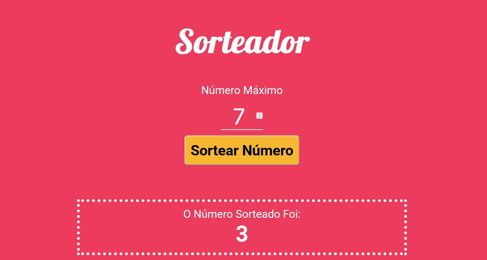

## Desafio

Neste exercício você deverá:

1. Criar um arquivo Gruntfile;
2. Executar a compilação do LESS;
3. Executar a compressão de código JavaScript;
4. Criar um branch chamada "exercicio_grunt";
5. Armazenar o arquivo Gruntfile nesta branch;
6. Enviar o link do repositório através da plataforma.

Project:
<p align="center">
  
</p>

## Durante o processo será feito um sorteador de números

## Iniciaremos o git e desde o começo teremos nosso projeto já hospedado no GitHub

## Criando projeto com `npm init`

click em `enter` durante todas as perguntas que aparecerem.

## Instalando `gunt` localmente no projeto `npm install --save-dev grunt`

## em `package.json` Vamos criar novo script:

```
 "scripts": {
    "grunt": "grunt",
    "test": "echo \"Error: no test specified\" && exit 1"
  },
```

## Criando arquivo `Gruntfile.js`

Para iniciar o grunt usamos :

```
module.exports = function (grunt) {
  // Project configuration.
  grunt.initConfig({
    pkg: grunt.file.readJSON('package.json'),
  });
}
```

## Criando arquivo .gitignore e add pastas que não serão levadas ao git/repositorio

## Instalando plugin do less `npm install --save-dev grunt-contrib-less`

Fazendo a configuração da tarefa, antes preisamos carregar o plugin no arquivo Gruntfile e depois a configuração da tarefa.

```
// Load the plugins
  grunt.loadNpmTasks('grunt-contrib-less');  // For compiling LESS files
```

## Criando branch como pedido na tarefa, `exercicio_grunt`

## Organizando project com `development` e `build`

pasta `dev` de desenvolvimento, onde estaremos a fazer nossas atividades e mudanças, estaremos projetando/trabalhando e a pasta de `build` que será o ambiente utilizado na hora de colocar nossa página no ar.

## Alteração no registro de task no `gruntFile`

```
  // Default task(s).
  grunt.registerTask('default', ['less:development']);
  grunt.registerTask('build', ['less:production']);
```

## Mudaremos o script em `package.json`

```
 "scripts": {
    "grunt": "grunt",
    "build": "grunt build",
    "test": "echo \"Error: no test specified\" && exit 1"
  },
```

## Instalando puglin de watch

```
npm install --save-dev grunt-contrib-watch
```

importando/Carregando puglin no gruntFile

```
  grunt.loadNpmTasks('grunt-contrib-watch'); // For watching file changes
```

## Instalando puglin

```
 npm install --save-dev grunt-replace
```

Carregando puglin

```
  // Load the plugins
  grunt.loadNpmTasks('grunt-contrib-less'); // For compiling LESS files
  grunt.loadNpmTasks('grunt-contrib-watch'); // For watching file changes
  grunt.loadNpmTasks('grunt-replace'); // For replacing text in files
  // grunt.loadNpmTasks('grunt-contrib-uglify'); // For minifying JavaScript files

  // Default task(s).
  grunt.registerTask('default', ['watch']);
  grunt.registerTask('build', ['less:production']);

```

Configurando pugl in

```
replace: {
      dev: {
        options: {
          patterns: [
            {
              match: 'ENDERECO_DO_CSS',
              replacement: './styles/main.css',
            },
          ],
        },
        files: [
          {
            expand: true,
            flatten: true,
            src: ['dev/index.html'],
            dest: 'dev/',
          },
        ],
      },
    },
```

Rodando o replace no terminal

```
npm run grunt replace:dev
```

## instalando minificador de html

```
npm install --save-dev grunt-contrib-htmlmin
```

Carregar o puglin no arquivo gruntFile

```
  grunt.loadNpmTasks('grunt-contrib-htmlmin'); // For minifying HTML files
```

Configurando o minificador, aqui criaremos uma pasta temporaria `prebuild`

```
htmlmin: {
      dist: {
        options: {
          removeComments: true,
          collapseWhitespace: true,
        },
        files: {
          'prebuild/index.html': 'src/index.html', // Destination file
        },
      },
    },
```

Comando para rodar no terminal

```
 npm run grunt htmlmin:dist
```

Vamos mudar o css

```
 dist: {
        options: {
          patterns: [
            {
              match: 'ENDERECO_DO_CSS',
              replacement: './styles/main.min.css',
            },
          ],
        },
        files: [
          {
            expand: true,
            flatten: true,
            src: ['prebuild/index.html'],
            dest: 'dist/',
          },
        ],
      },
```

```
  grunt.registerTask('build', ['less:production', 'htmlmin:dist', 'replace:dist']);
```

No terminal

```
npm run grunt build
```

Depois de fazermos essa execução iremos apagar a pasta temporaria `prebuild` usando um puglin

## Instalando puglin

```
npm install --save-dev grunt-contrib-clean
```

Carregar Puglin

```
  grunt.loadNpmTasks('grunt-contrib-clean'); // For cleaning directories
```

Configurando puglin

```
   clean: ['prebuild'] // Clean the prebuild directory before building
```

tarefas a serem executadas

```
  // Default task(s).
  grunt.registerTask('default', ['watch']);
  grunt.registerTask('build', ['less:production', 'htmlmin:dist', 'replace:dist', 'clean']);
```

No terminal usamos

```
npm run grunt build
```

## Atualizamos o `watch`

```
watch: {
  less: {
    files: ['src/styles/**/*.less'], // Watch all LESS files in the src/styles directory
    tasks: ['less:development'], // Run the development task when a file changes
  },
  html: {
    files: ['src/index.html'], // Watch the main HTML file
    tasks: ['replace:dev'], // Run the replace task when the HTML file changes
  },
}
```

## Instalando puglin para minificar arquivo js

```
npm install --save-dev grunt-contrib-uglify
```

carregando puglin

```
  grunt.loadNpmTasks('grunt-contrib-uglify'); // For minifying JavaScript files
```

Configurando puglin no arquivo gruntFile

```
uglify: {
  target : {
    files: {
      'dist/scripts/main.min.js': ['src/scripts/main.js'], // Minify the main JavaScript file
    },
  },
},
```

```
grunt.registerTask('default', ['watch']);
grunt.registerTask('build', [
  'less:production',
  'htmlmin:dist',
  'replace:dist',
  'clean',
  'uglify',
]);
```

No terminal usamos:

```
npm run grunt build
```
